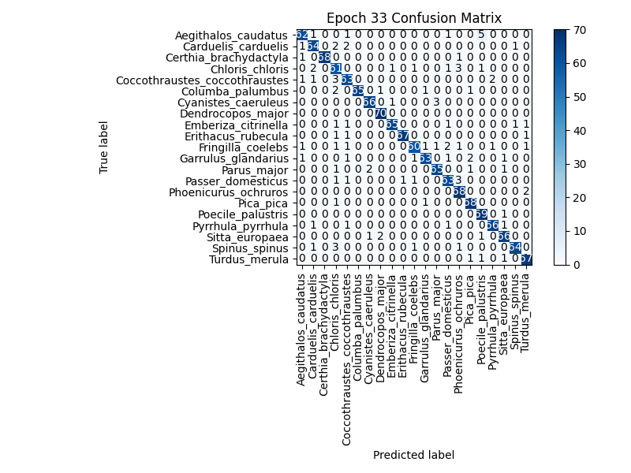

# WatchMyBirds-Classifier

This dataset from [**WatchMyBirds-Data**](https://github.com/arminfabritzek/WatchMyBirds-Data)
was used to train the model for [**WatchMyBirds**](https://github.com/arminfabritzek/WatchMyBirds).


The model was trained on 21 classes using a balanced dataset, where only species with between 400 and 470 images were included.

---




---


# Dataset Statistics

## Train Split
| Species | Number of Images |
|---------|------------------|
| Aegithalos_caudatus | 390 |
| Carduelis_carduelis | 390 |
| Certhia_brachydactyla | 390 |
| Chloris_chloris | 390 |
| Coccothraustes_coccothraustes | 390 |
| Columba_palumbus | 390 |
| Cyanistes_caeruleus | 390 |
| Dendrocopos_major | 390 |
| Emberiza_citrinella | 390 |
| Erithacus_rubecula | 390 |
| Fringilla_coelebs | 390 |
| Garrulus_glandarius | 390 |
| Parus_major | 390 |
| Passer_domesticus | 390 |
| Phoenicurus_ochruros | 390 |
| Pica_pica | 390 |
| Poecile_palustris | 390 |
| Pyrrhula_pyrrhula | 390 |
| Sitta_europaea | 390 |
| Spinus_spinus | 390 |
| Turdus_merula | 390 |

**Total images in train: 8190**

## Val Split
| Species | Number of Images |
|---------|------------------|
| Aegithalos_caudatus | 70 |
| Carduelis_carduelis | 70 |
| Certhia_brachydactyla | 70 |
| Chloris_chloris | 70 |
| Coccothraustes_coccothraustes | 70 |
| Columba_palumbus | 70 |
| Cyanistes_caeruleus | 70 |
| Dendrocopos_major | 70 |
| Emberiza_citrinella | 70 |
| Erithacus_rubecula | 70 |
| Fringilla_coelebs | 70 |
| Garrulus_glandarius | 70 |
| Parus_major | 70 |
| Passer_domesticus | 70 |
| Phoenicurus_ochruros | 70 |
| Pica_pica | 70 |
| Poecile_palustris | 70 |
| Pyrrhula_pyrrhula | 70 |
| Sitta_europaea | 70 |
| Spinus_spinus | 70 |
| Turdus_merula | 70 |

**Total images in val: 1470**

## Test Split
| Species | Number of Images |
|---------|------------------|
| Aegithalos_caudatus | 10 |
| Carduelis_carduelis | 10 |
| Certhia_brachydactyla | 10 |
| Chloris_chloris | 10 |
| Coccothraustes_coccothraustes | 10 |
| Columba_palumbus | 10 |
| Cyanistes_caeruleus | 10 |
| Dendrocopos_major | 10 |
| Emberiza_citrinella | 10 |
| Erithacus_rubecula | 10 |
| Fringilla_coelebs | 10 |
| Garrulus_glandarius | 10 |
| Parus_major | 10 |
| Passer_domesticus | 10 |
| Phoenicurus_ochruros | 10 |
| Pica_pica | 10 |
| Poecile_palustris | 10 |
| Pyrrhula_pyrrhula | 10 |
| Sitta_europaea | 10 |
| Spinus_spinus | 10 |
| Turdus_merula | 10 |

**Total images in test: 210**

## Overall Dataset Summary
**Total images in dataset:** 9870

### Overall Species Counts
| Species | Total Number of Images |
|---------|------------------------|
| Aegithalos_caudatus | 470 |
| Carduelis_carduelis | 470 |
| Certhia_brachydactyla | 470 |
| Chloris_chloris | 470 |
| Coccothraustes_coccothraustes | 470 |
| Columba_palumbus | 470 |
| Cyanistes_caeruleus | 470 |
| Dendrocopos_major | 470 |
| Emberiza_citrinella | 470 |
| Erithacus_rubecula | 470 |
| Fringilla_coelebs | 470 |
| Garrulus_glandarius | 470 |
| Parus_major | 470 |
| Passer_domesticus | 470 |
| Phoenicurus_ochruros | 470 |
| Pica_pica | 470 |
| Poecile_palustris | 470 |
| Pyrrhula_pyrrhula | 470 |
| Sitta_europaea | 470 |
| Spinus_spinus | 470 |
| Turdus_merula | 470 |


---

| Key | Value |
| --- | --- |
| model_name | efficientnet_b0 |
| image_size | 224 |
| _batch_size | 256 |
| _learning_rate | 0.0002 |
| _initial_lr | 1e-05 |
| _early_stop_patience | 5 |
| _warmup_epochs | 5 |
| criterion | {'type': 'CrossEntropyLoss'} |
| optimizer | {'type': 'Adam', 'learning_rate': 0.0002, 'weight_decay': 0, 'initial_lr': 0.0002} |
| scheduler | {'type': 'ReduceLROnPlateau', 'mode': 'max', 'factor': 0.1, 'patience': 5} |


---

```json
{
    "model_name": "efficientnet_b0",
    "image_size": 224,
    "_batch_size": 256,
    "_learning_rate": 0.0002,
    "_initial_lr": 1e-05,
    "_early_stop_patience": 5,
    "_warmup_epochs": 5,
    "criterion": {
        "type": "CrossEntropyLoss"
    },
    "optimizer": {
        "type": "Adam",
        "learning_rate": 0.0002,
        "weight_decay": 0,
        "initial_lr": 0.0002
    },
    "scheduler": {
        "type": "ReduceLROnPlateau",
        "mode": "max",
        "factor": 0.1,
        "patience": 5
    }
}
```