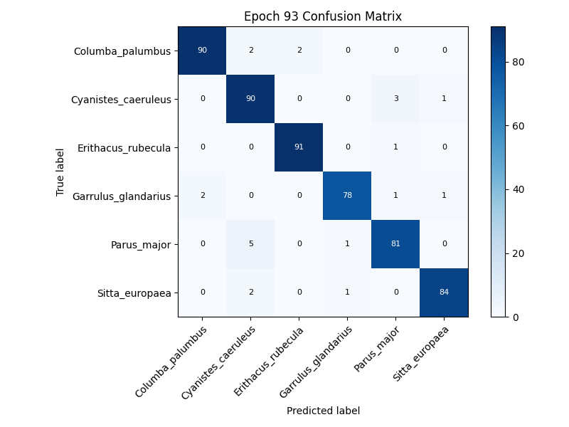
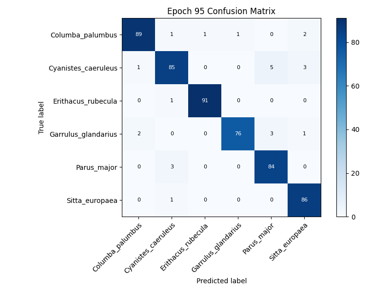
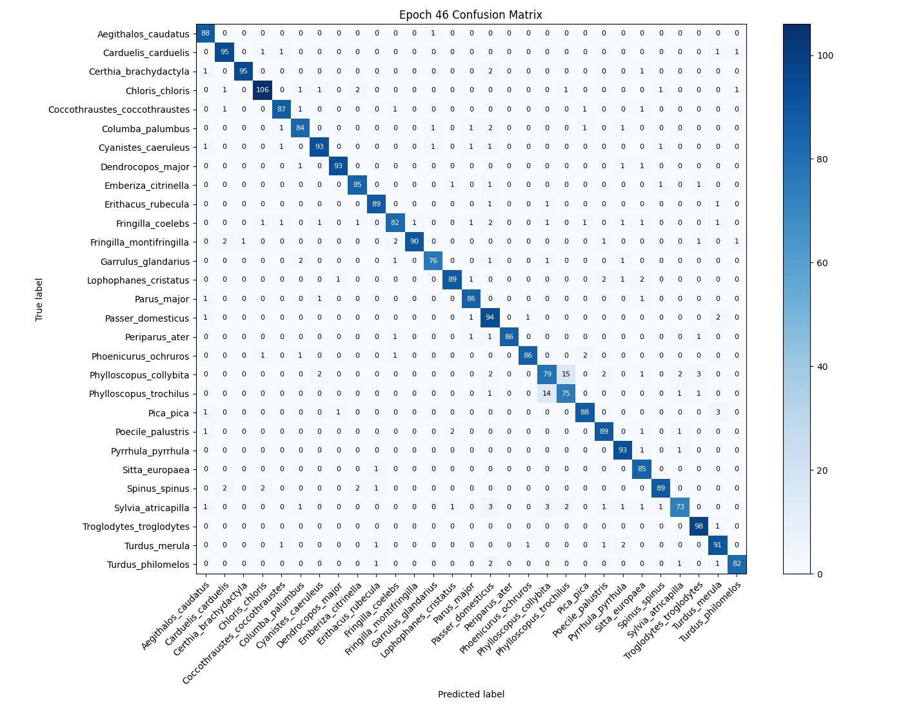
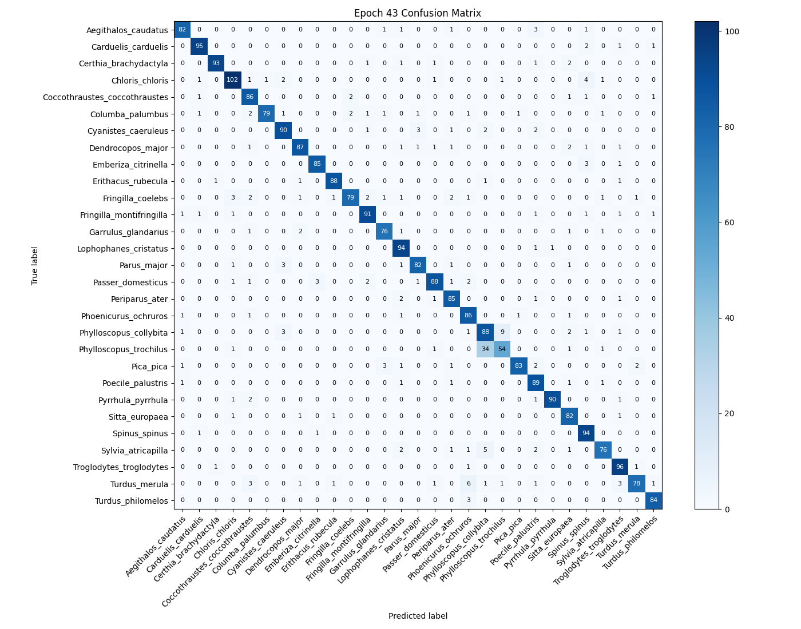
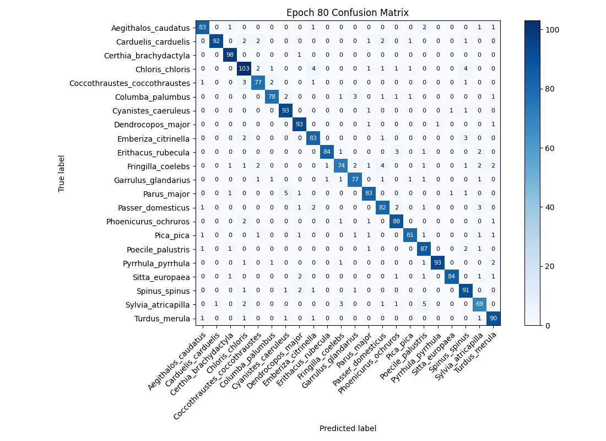

# WatchMyBirds-Classifier Models

This repository contains machine learning models trained for the [**WatchMyBirds**](https://github.com/arminfabritzek/WatchMyBirds) project, used for classifying bird species from images.

## Scripts overview

- **7_CLASSI_prepare_data_classify_v0x.py**
Automates preparation of a species‐classification dataset: reads and filters metadata, creates and resizes square image crops per species, splits into train/val/test, balances classes via augmentation and downsampling, and outputs the final organized folders with run settings.

- **8_CLASSI_train_efficientnet_v0x.py**
Fine-tunes an EfficientNet classifier on the prepared dataset: sets up data transforms and loaders, initializes model architecture and hyperparameters, runs mixed-precision training with mixup/cutmix, backbone unfreezing and learning-rate scheduling, logs metrics to TensorBoard, saves and exports the best weights (including ONNX), and records all run settings.


## Results

The models were trained using data derived from [**WatchMyBirds-Data**](https://github.com/arminfabritzek/WatchMyBirds-Data).

Dataset potentially used for training included **6** classes.
General dataset balancing parameters (if applicable, from basic settings):
- Minimum samples per class for inclusion: `410`
- Maximum samples per class (capped at): `500`
*(Note: Specific runs might use different parameters, check details below)*

---
## Trained Model Versions

Below are details for each available training run, typically sorted newest first. Models and associated artifacts are stored in the `models/` directory, organized by training timestamp.


### Model Version: `20250409_180610` (Type: `efficientnet_b2`)
**Confusion Matrix:**
**Training Parameters (Table):**| Key | Value |
| --- | --- |
| adamW_weight_decay | 0.0007 |
| batch_size | 256 |
| criterion | `{"type": "CrossEntropyLoss", "label_smoothing": 0.1}` |
| early_stop_patience | 15 |
| full_finetune_lr | 0.0001 |
| image_size | 256 |
| initial_head_lr | 0.001 |
| model_name | efficientnet_b2 |
| num_classes | 6 |
| num_epochs_total | 200 |
| optimizer_type | AdamW |
| scheduler_type | SequentialLR (LinearWarmup + CosineAnnealing) |
| unfreeze_epoch | 10 |
| warmup_epochs | 5 |

**Training Parameters (Raw JSON):**```json
{
    "adamW_weight_decay": 0.0007,
    "batch_size": 256,
    "criterion": {
        "label_smoothing": 0.1,
        "type": "CrossEntropyLoss"
    },
    "early_stop_patience": 15,
    "full_finetune_lr": 0.0001,
    "image_size": 256,
    "initial_head_lr": 0.001,
    "model_name": "efficientnet_b2",
    "num_classes": 6,
    "num_epochs_total": 200,
    "optimizer_type": "AdamW",
    "scheduler_type": "SequentialLR (LinearWarmup + CosineAnnealing)",
    "unfreeze_epoch": 10,
    "warmup_epochs": 5
}
```
---


### Model Version: `20250409_104415` (Type: `efficientnet_b2`)
**Confusion Matrix:**
**Training Parameters (Table):**| Key | Value |
| --- | --- |
| adamW_weight_decay | 0.0007 |
| batch_size | 256 |
| criterion | `{"type": "CrossEntropyLoss", "label_smoothing": 0.1}` |
| early_stop_patience | 15 |
| full_finetune_lr | 0.0001 |
| image_size | 256 |
| initial_head_lr | 0.001 |
| model_name | efficientnet_b2 |
| num_classes | 6 |
| num_epochs_total | 200 |
| optimizer_type | AdamW |
| scheduler_type | SequentialLR (LinearWarmup + CosineAnnealing) |
| unfreeze_epoch | 10 |
| warmup_epochs | 5 |

**Training Parameters (Raw JSON):**```json
{
    "adamW_weight_decay": 0.0007,
    "batch_size": 256,
    "criterion": {
        "label_smoothing": 0.1,
        "type": "CrossEntropyLoss"
    },
    "early_stop_patience": 15,
    "full_finetune_lr": 0.0001,
    "image_size": 256,
    "initial_head_lr": 0.001,
    "model_name": "efficientnet_b2",
    "num_classes": 6,
    "num_epochs_total": 200,
    "optimizer_type": "AdamW",
    "scheduler_type": "SequentialLR (LinearWarmup + CosineAnnealing)",
    "unfreeze_epoch": 10,
    "warmup_epochs": 5
}
```
---


### Model Version: `20250404_121256` (Type: `efficientnet_b2`)
**Confusion Matrix:**
**Training Parameters (Table):**| Key | Value |
| --- | --- |
| adamW_weight_decay | 0.0007 |
| batch_size | 256 |
| criterion | `{"type": "CrossEntropyLoss", "label_smoothing": 0.1}` |
| early_stop_patience | 15 |
| full_finetune_lr | 0.0001 |
| image_size | 256 |
| initial_head_lr | 0.001 |
| model_name | efficientnet_b2 |
| num_classes | 29 |
| num_epochs_total | 200 |
| optimizer_type | AdamW |
| scheduler_type | SequentialLR (LinearWarmup + CosineAnnealing) |
| unfreeze_epoch | 10 |
| warmup_epochs | 5 |

**Training Parameters (Raw JSON):**```json
{
    "adamW_weight_decay": 0.0007,
    "batch_size": 256,
    "criterion": {
        "label_smoothing": 0.1,
        "type": "CrossEntropyLoss"
    },
    "early_stop_patience": 15,
    "full_finetune_lr": 0.0001,
    "image_size": 256,
    "initial_head_lr": 0.001,
    "model_name": "efficientnet_b2",
    "num_classes": 29,
    "num_epochs_total": 200,
    "optimizer_type": "AdamW",
    "scheduler_type": "SequentialLR (LinearWarmup + CosineAnnealing)",
    "unfreeze_epoch": 10,
    "warmup_epochs": 5
}
```
---


### Model Version: `20250404_111958` (Type: `efficientnet_b1`)
**Confusion Matrix:**
**Training Parameters (Table):**| Key | Value |
| --- | --- |
| adamW_weight_decay | 0.0006 |
| batch_size | 256 |
| criterion | `{"type": "CrossEntropyLoss", "label_smoothing": 0.1}` |
| early_stop_patience | 15 |
| full_finetune_lr | 0.0001 |
| image_size | 240 |
| initial_head_lr | 0.001 |
| model_name | efficientnet_b1 |
| num_classes | 29 |
| num_epochs_total | 200 |
| optimizer_type | AdamW |
| scheduler_type | SequentialLR (LinearWarmup + CosineAnnealing) |
| unfreeze_epoch | 10 |
| warmup_epochs | 5 |

**Training Parameters (Raw JSON):**```json
{
    "adamW_weight_decay": 0.0006,
    "batch_size": 256,
    "criterion": {
        "label_smoothing": 0.1,
        "type": "CrossEntropyLoss"
    },
    "early_stop_patience": 15,
    "full_finetune_lr": 0.0001,
    "image_size": 240,
    "initial_head_lr": 0.001,
    "model_name": "efficientnet_b1",
    "num_classes": 29,
    "num_epochs_total": 200,
    "optimizer_type": "AdamW",
    "scheduler_type": "SequentialLR (LinearWarmup + CosineAnnealing)",
    "unfreeze_epoch": 10,
    "warmup_epochs": 5
}
```
---


### Model Version: `20250404_095937` (Type: `efficientnet_b1`)
**Confusion Matrix:**
**Training Parameters (Table):**| Key | Value |
| --- | --- |
| adamW_weight_decay | 0.0007 |
| batch_size | 256 |
| criterion | `{"type": "CrossEntropyLoss", "label_smoothing": 0.1}` |
| early_stop_patience | 15 |
| full_finetune_lr | 0.0002 |
| image_size | 240 |
| initial_head_lr | 0.002 |
| model_name | efficientnet_b1 |
| num_classes | 29 |
| num_epochs_total | 200 |
| optimizer_type | AdamW |
| scheduler_type | SequentialLR (LinearWarmup + CosineAnnealing) |
| unfreeze_epoch | 10 |
| warmup_epochs | 5 |

**Training Parameters (Raw JSON):**```json
{
    "adamW_weight_decay": 0.0007,
    "batch_size": 256,
    "criterion": {
        "label_smoothing": 0.1,
        "type": "CrossEntropyLoss"
    },
    "early_stop_patience": 15,
    "full_finetune_lr": 0.0002,
    "image_size": 240,
    "initial_head_lr": 0.002,
    "model_name": "efficientnet_b1",
    "num_classes": 29,
    "num_epochs_total": 200,
    "optimizer_type": "AdamW",
    "scheduler_type": "SequentialLR (LinearWarmup + CosineAnnealing)",
    "unfreeze_epoch": 10,
    "warmup_epochs": 5
}
```
---


### Model Version: `20250328_061115` (Type: `efficientnet_b0`)
**Confusion Matrix:**
**Training Parameters (Table):**| Key | Value |
| --- | --- |
| adamW_weight_decay | 0.0004 |
| batch_size | 256 |
| criterion | `{"type": "CrossEntropyLoss", "label_smoothing": 0.1}` |
| early_stop_patience | 15 |
| full_finetune_lr | 0.0001 |
| image_size | 224 |
| initial_head_lr | 0.001 |
| model_name | efficientnet_b0 |
| num_classes | 22 |
| num_epochs_total | 200 |
| optimizer_type | AdamW |
| scheduler_type | SequentialLR (LinearWarmup + CosineAnnealing) |
| unfreeze_epoch | 10 |
| warmup_epochs | 5 |

**Training Parameters (Raw JSON):**```json
{
    "adamW_weight_decay": 0.0004,
    "batch_size": 256,
    "criterion": {
        "label_smoothing": 0.1,
        "type": "CrossEntropyLoss"
    },
    "early_stop_patience": 15,
    "full_finetune_lr": 0.0001,
    "image_size": 224,
    "initial_head_lr": 0.001,
    "model_name": "efficientnet_b0",
    "num_classes": 22,
    "num_epochs_total": 200,
    "optimizer_type": "AdamW",
    "scheduler_type": "SequentialLR (LinearWarmup + CosineAnnealing)",
    "unfreeze_epoch": 10,
    "warmup_epochs": 5
}
```
---

---
## Detailed Dataset Statistics

The following statistics are based on the `dataset_reference.json` file provided during README generation.

# Dataset Statistics

## Train Split
| Species | Number of Images |
|---------|------------------|
| Columba_palumbus | 500 |
| Cyanistes_caeruleus | 500 |
| Erithacus_rubecula | 500 |
| Garrulus_glandarius | 500 |
| Parus_major | 500 |
| Sitta_europaea | 500 |

**Total images in train: 3000**

## Val Split
| Species | Number of Images |
|---------|------------------|
| Columba_palumbus | 94 |
| Cyanistes_caeruleus | 94 |
| Erithacus_rubecula | 92 |
| Garrulus_glandarius | 82 |
| Parus_major | 87 |
| Sitta_europaea | 87 |

**Total images in val: 536**

## Test Split
| Species | Number of Images |
|---------|------------------|
| Columba_palumbus | 12 |
| Cyanistes_caeruleus | 12 |
| Erithacus_rubecula | 11 |
| Garrulus_glandarius | 11 |
| Parus_major | 11 |
| Sitta_europaea | 11 |

**Total images in test: 68**

## Overall Dataset Summary
**Total images in dataset:** 3604

### Overall Species Counts
| Species | Total Number of Images |
|---------|------------------------|
| Columba_palumbus | 606 |
| Cyanistes_caeruleus | 606 |
| Erithacus_rubecula | 603 |
| Garrulus_glandarius | 593 |
| Parus_major | 598 |
| Sitta_europaea | 598 |
